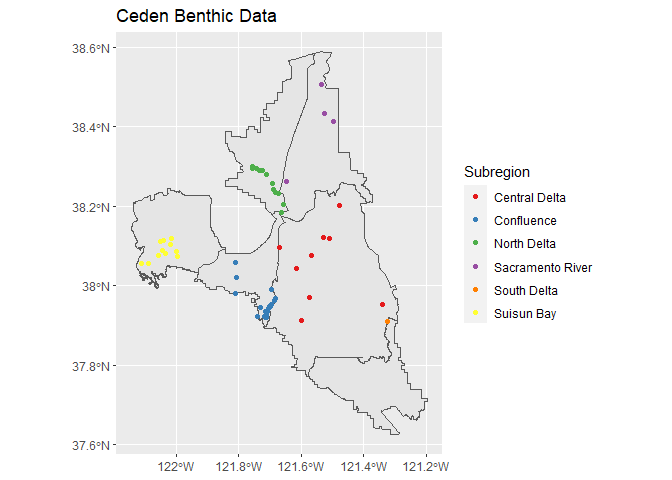
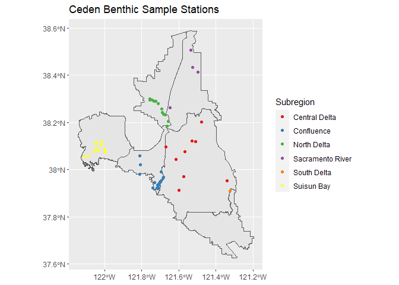
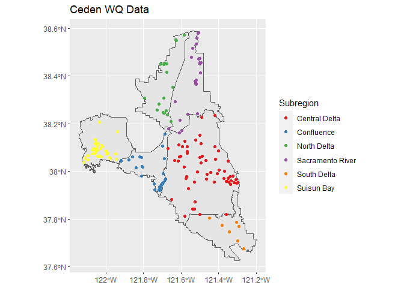
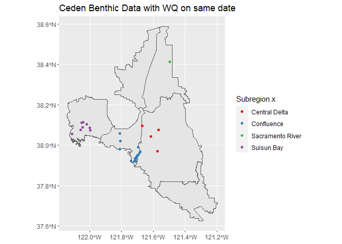

## CEDEN Data 

This document covers the data analysis for the benthic macroinvertebrate dataset obtained from the CEDEN Advanced Query Tool: 

    https://ceden.waterboards.ca.gov/AdvancedQueryTool

I downloaded the CEDEN Benthic data with the following parameters:

   Region selection by County: Contra Costa, Sacramento, San Joaquin, Solano, and Yolo.

   Date Range: 1/1/2010 to 6/19/2019 (latest available date).

I also used the CEDEN water quality data from the Tox Box accessed on 12/13/2020:

   Z:\\Upper San Francisco Project\\Data & Analyses\\Year 2\\CEDEN Files by Topic\\CEDEN Water WQ Data.xlsx

## Risk Regions
   
To assign risk regions to the data with spatial coordinates, I used the RiskRegions_DWSC_Update_9292020.shp shapefile obtained from the Tox Box.


## Load in libraries and data


```r
library(tidyverse)
library(sf)
library(here)
library(readxl)

# Load risk regions shapefile
USFE.riskregions <- here("data/RiskRegions_DWSC_Update_9292020.shp") %>%
  st_read()

# Create WGS84 projection variable
crs.WGS84 <- st_crs(USFE.riskregions)

#Load in CEDEN data
CEDEN <- read_excel("data/ceden_data_edited.xlsx")
```

## Set CEDEN Projection to WGS84

The CEDEN data has data with different coordinate systems depending on the source project. I separated the projects by coordinate systems into separate dataframes, converted the dataframes to WGS84 seperately, then recombined them. There were some data that had no known coordinate system so those were excluded from the analysis.

EPSG numbers for different coordinate systems can be found at https://spatialreference.org/ref/epsg/


```r
### Separate by Datum
unique(CEDEN$Datum)

ceden.wgs84 <- filter(CEDEN, Datum == "WGS84")
ceden.nad83 <- filter(CEDEN, Datum == "NAD83")
ceden.nr <- filter(CEDEN, Datum == "NR")
ceden.NAD27 <- filter(CEDEN, Datum == "NAD27")

### set Datum, shapefiles

ceden.wgs84.sf <- ceden.wgs84 %>%
  st_as_sf(coords=c("TargetLongitude", "TargetLatitude"), crs = crs.WGS84)

ceden.nad83.sf <- ceden.nad83 %>%
  st_as_sf(coords=c("TargetLongitude", "TargetLatitude"), crs = 4269)

ceden.NAD27.sf <- ceden.NAD27 %>%
  st_as_sf(coords=c("TargetLongitude", "TargetLatitude"), crs = 4267)

# ceden.nr does not have a known coordinate system

### Transform into WGS84

ceden.nad83.t.wgs84.sf <- st_transform(ceden.nad83.sf, crs.WGS84)
st_crs(ceden.nad83.t.wgs84.sf)

ceden.NAD27.t.wgs84.sf <- st_transform(ceden.NAD27.sf, crs.WGS84)
st_crs(ceden.NAD27.t.wgs84.sf)


### Join Excel Data to Risk Regions
ceden.wgs84.sf <- st_join(ceden.wgs84.sf, USFE.riskregions["Subregion"])
ceden.nad83.t.wgs84.sf <- st_join(ceden.nad83.t.wgs84.sf, USFE.riskregions["Subregion"])
ceden.NAD27.t.wgs84.sf <- st_join(ceden.NAD27.t.wgs84.sf, USFE.riskregions["Subregion"])

### Combine datasets
ceden.all.sf <- bind_rows(ceden.wgs84.sf, ceden.nad83.t.wgs84.sf)
ceden.all.sf <- bind_rows(ceden.all.sf, ceden.NAD27.t.wgs84.sf)

### Remove records outside of Risk Regions

ceden.all.sf <- ceden.all.sf %>%
  filter(!is.na(Subregion))
```

## Plot Ceden Data and Write csv

```r
# Basic plot
ggplot() +
  geom_sf(data = USFE.riskregions) +
  geom_sf(data = ceden.all.sf, aes(color = Subregion)) +
  scale_color_brewer(palette = "Set1") + # not color-blind safe
  ggtitle("Ceden Benthic Data")
```

<!-- -->

```r
# Write table

# write.csv(ceden.all.sf, "data/ceden_with_RR.csv") # Already printed to csv
```

# Analysis

## Organize Data

I built a dataframe that grouped the data by station code and sample date so that each record is a sampling event. I summarized the number of taxa and counts by selected Orders and all Phylums. I also calculated the EPT and ETO indicies and taxa counts.


I selected the orders most commonly used in community indicies.

Orders: 

* Ephemeroptera (n_E)
* Plecoptera (n_P)
* Trichoptera (n_T)
* Odonata (n_O)
* Diptera (n_D)


```r
##### Create dataframe set into groups by station and sample date to isolate individual samples.
##### summarise by taxa presence, number of taxa present, and indexes

samp.df <- ceden.all.sf %>%
  group_by(StationCode, SampleDate) %>%
  summarise(Subregion = first(Subregion),
            StationName = first(StationName),
            Project = first(Project),
            Projectcode = first(Projectcode),
            n_taxa = n(),
            n_E = sum(Orders == "Ephemeroptera", na.rm = TRUE),
            n_P = sum(Orders == "Plecoptera", na.rm = TRUE),
            n_T = sum(Orders == "Trichoptera", na.rm = TRUE),
            n_O = sum(Orders == "Odonata", na.rm = TRUE),
            n_D = sum(Orders == "Diptera", na.rm = TRUE),
            n_Phylum_NA = sum(is.na(Phylum)),
            n_Arthropoda = sum(Phylum == "Arthropoda", na.rm = TRUE),
            n_Annelida = sum(Phylum == "Annelida", na.rm = TRUE),
            n_Nematoda = sum(Phylum == "Nematoda", na.rm = TRUE),
            n_Ectoprocta = sum(Phylum == "Ectoprocta", na.rm = TRUE),
            n_Bacillariophyta = sum(Phylum == "Bacillariophyta", na.rm = TRUE),
            n_Cryptophyta = sum(Phylum == "Cryptophyta", na.rm = TRUE),
            n_Heterokontophyta = sum(Phylum == "Heterokontophyta", na.rm = TRUE),
            n_Ochrophyta = sum(Phylum == "Ochrophyta", na.rm = TRUE),
            n_Coelenterata = sum(Phylum == "Coelenterata", na.rm = TRUE),
            n_Nemertea = sum(Phylum == "Nemertea", na.rm = TRUE),
            n_Mollusca = sum(Phylum == "Mollusca", na.rm = TRUE),
            n_Platyhelminthes = sum(Phylum == "Platyhelminthes", na.rm = TRUE),
            n_Bryozoa = sum(Phylum == "Bryozoa", na.rm = TRUE),
            n_Cyanobacteria = sum(Phylum == "Cyanobacteria", na.rm = TRUE),
            n_Chlorophyta = sum(Phylum == "Chlorophyta", na.rm = TRUE),
            n_Euglenozoa = sum(Phylum == "Euglenozoa", na.rm = TRUE),
            n_Streptophyta = sum(Phylum == "Streptophyta", na.rm = TRUE),
            n_Rhodophyta = sum(Phylum == "Rhodophyta", na.rm = TRUE),
            n_Chordata = sum(Phylum == "Chordata", na.rm = TRUE)
            ) %>%
  mutate(EPT_taxa = sum(n_E, n_P, n_T)) %>%  ### Calculate indexes using mutate
  mutate(EPT_index = EPT_taxa / n_taxa) %>%
  mutate(ETO_taxa = sum(n_E, n_O, n_T)) %>%
  mutate(ETO_index = ETO_taxa / n_taxa)
```


```r
tibble(samp.df) # 160 obsv
```

```
## # A tibble: 160 x 37
##    StationCode SampleDate          Subregion StationName Project Projectcode
##    <chr>       <dttm>              <chr>     <chr>       <chr>   <chr>      
##  1 510CR0036   2018-06-18 00:00:00 Sacramen~ Sacramento~ Nation~ EPA_NRSA_2~
##  2 510CR0322   2018-06-20 00:00:00 Sacramen~ Miner Slou~ Nation~ EPA_NRSA_2~
##  3 510CR1007   2013-06-03 00:00:00 Sacramen~ Sacramento~ Nation~ EPA_NRSA_2~
##  4 510CS01xx   2012-03-27 00:00:00 North De~ Cache Slou~ Univer~ UMD        
##  5 510CS01xx   2012-10-12 00:00:00 North De~ Cache Slou~ Univer~ UMD        
##  6 510CS01xx   2013-03-26 00:00:00 North De~ Cache Slou~ Univer~ UMD        
##  7 510CS01xx   2013-10-07 00:00:00 North De~ Cache Slou~ Univer~ UMD        
##  8 510CS01xx   2014-03-28 00:00:00 North De~ Cache Slou~ Univer~ UMD        
##  9 510CS01xx   2014-10-04 00:00:00 North De~ Cache Slou~ Univer~ UMD        
## 10 510CS02xx   2012-03-27 00:00:00 North De~ Cache Slou~ Univer~ UMD        
## # ... with 150 more rows, and 31 more variables: n_taxa <int>, n_E <int>,
## #   n_P <int>, n_T <int>, n_O <int>, n_D <int>, n_Phylum_NA <int>,
## #   n_Arthropoda <int>, n_Annelida <int>, n_Nematoda <int>, n_Ectoprocta <int>,
## #   n_Bacillariophyta <int>, n_Cryptophyta <int>, n_Heterokontophyta <int>,
## #   n_Ochrophyta <int>, n_Coelenterata <int>, n_Nemertea <int>,
## #   n_Mollusca <int>, n_Platyhelminthes <int>, n_Bryozoa <int>,
## #   n_Cyanobacteria <int>, n_Chlorophyta <int>, n_Euglenozoa <int>,
## #   n_Streptophyta <int>, n_Rhodophyta <int>, n_Chordata <int>, geometry <POINT
## #   [°]>, EPT_taxa <int>, EPT_index <dbl>, ETO_taxa <int>, ETO_index <dbl>
```

## Dataframe with one record for station

This dataframe is used for mapping.


```r
st.df <- ceden.all.sf %>%
  group_by(StationCode) %>%
  summarise(n(), n_distinct(SampleDate), first(Subregion)) %>%
  rename(Subregion = `first(Subregion)`)
```


```r
# Sample Stations Plot
ggplot() +
  geom_sf(data = USFE.riskregions) +
  geom_sf(data = st.df, aes(color = Subregion)) +
  scale_color_brewer(palette = "Set1") + # not color-blind safe
  ggtitle("Ceden Benthic Sample Stations")
```

<!-- -->

## Water Quality Data


```r
# Bring in WQ data
ceden.wq <- read_excel("data/ceden_wq.xlsx")

#Remove records without lat/lon
ceden.wq <- ceden.wq[!is.na(ceden.wq$TargetLatitude),]

# Excel Data to sf Object: needs x, y, CRS
ceden.wq <- ceden.wq %>%
  st_as_sf(coords=c("TargetLongitude", "TargetLatitude"), crs = crs.WGS84)

# Spatial Join to add risk regions
ceden.wq.sf <- st_join(ceden.wq, USFE.riskregions["Subregion"])

# Remove records outside of Risk Regions
ceden.wq.sf <- ceden.wq.sf %>%
  filter(!is.na(Subregion))
```


```r
# Basic plot
ggplot() +
  geom_sf(data = USFE.riskregions) +
  geom_sf(data = ceden.wq.sf, aes(color = Subregion)) +
  scale_color_brewer(palette = "Set1") + # not color-blind safe
  ggtitle("Ceden WQ Data")
```

<!-- -->


## Organize Water Quality Data

I created a dataframe that grouped by station name and sample date where each record is a water quality sampling event. This way the water quality sampling events can be matched up the the MI sampling events by location and timing.

This dataframe summarized water quality parameters by number of samples during that day, mean, standard deviation, minimum value, and maximum value. Though most of the parameters only had one measurement for the day.

The parameters included were:
* Alkalinity as CaCO3, Total
* Ammonia as N, Total
* Chlorine, Free, Total
* Chlorine, Total Residue, Total
* Oxygen, Dissolved, Total
* pH
* Salinity, Total
* Secchi Depth
* Specific Conductivity, Total
* Temperature
* Turbidity, Total
* Velocity


```r
wq.stations <- ceden.wq.sf %>%
  group_by(StationName, SampleDate) %>%
  summarise(Project = first(Project),
            n = n(),
            Subregion = first(Subregion),
            
            n_Alk = sum(Analyte == "Alkalinity as CaCO3, Total", na.rm = TRUE),
            mean_Alk = mean(Result[Analyte == "Alkalinity as CaCO3, Total"], na.rm = TRUE),
            sd_Alk = sd(Result[Analyte == "Alkalinity as CaCO3, Total"], na.rm = TRUE),
            min_Alk = min(Result[Analyte == "Alkalinity as CaCO3, Total"], na.rm = TRUE),
            max_Alk = max(Result[Analyte == "Alkalinity as CaCO3, Total"], na.rm = TRUE),

            n_N = sum(Analyte == "Ammonia as N, Total", na.rm = TRUE),
            mean_N = mean(Result[Analyte == "Ammonia as N, Total"], na.rm = TRUE),
            sd_N = sd(Result[Analyte == "Ammonia as N, Total"], na.rm = TRUE),
            min_N = min(Result[Analyte == "Ammonia as N, Total"], na.rm = TRUE),
            max_N = max(Result[Analyte == "Ammonia as N, Total"], na.rm = TRUE),
            
            n_Chl_F = sum(Analyte == "Chlorine, Free, Total", na.rm = TRUE),
            mean_Chl_F = mean(Result[Analyte == "Chlorine, Free, Total"], na.rm = TRUE),
            sd_Chl_F = sd(Result[Analyte == "Chlorine, Free, Total"], na.rm = TRUE),
            min_Chl_F = min(Result[Analyte == "Chlorine, Free, Total"], na.rm = TRUE),
            max_Chl_F = max(Result[Analyte == "Chlorine, Free, Total"], na.rm = TRUE),
            
            n_Chl_TR = sum(Analyte == "Chlorine, Total Residual, Total", na.rm = TRUE),
            mean_Chl_TR = mean(Result[Analyte == "Chlorine, Total Residual, Total"], na.rm = TRUE),
            sd_Chl_TR = sd(Result[Analyte == "Chlorine, Total Residual, Total"], na.rm = TRUE),
            min_Chl_TR = min(Result[Analyte == "Chlorine, Total Residual, Total"], na.rm = TRUE),
            max_Chl_TR = max(Result[Analyte == "Chlorine, Total Residual, Total"], na.rm = TRUE),
            
            n_DO = sum(Analyte == "Oxygen, Dissolved, Total", na.rm = TRUE),
            mean_DO = mean(Result[Analyte == "Oxygen, Dissolved, Total"], na.rm = TRUE),
            sd_DO = sd(Result[Analyte == "Oxygen, Dissolved, Total"], na.rm = TRUE),
            min_DO = min(Result[Analyte == "Oxygen, Dissolved, Total"], na.rm = TRUE),
            max_DO = max(Result[Analyte == "Oxygen, Dissolved, Total"], na.rm = TRUE),
            
            n_pH = sum(Analyte == "pH", na.rm = TRUE),
            mean_pH = mean(Result[Analyte == "pH"], na.rm = TRUE),
            sd_pH = sd(Result[Analyte == "pH"], na.rm = TRUE),
            min_pH = min(Result[Analyte == "pH"], na.rm = TRUE),
            max_pH = max(Result[Analyte == "pH"], na.rm = TRUE),
            
            n_Sal = sum(Analyte == "Salinity, Total", na.rm = TRUE),
            mean_Sal = mean(Result[Analyte == "Salinity, Total"], na.rm = TRUE),
            sd_Sal = sd(Result[Analyte == "Salinity, Total"], na.rm = TRUE),
            min_Sal = min(Result[Analyte == "Salinity, Total"], na.rm = TRUE),
            max_Sal = max(Result[Analyte == "Salinity, Total"], na.rm = TRUE),
            
            n_Secc = sum(Analyte == "Secchi Depth", na.rm = TRUE),
            mean_Secc = mean(Result[Analyte == "Secchi Depth"], na.rm = TRUE),
            sd_Secc = sd(Result[Analyte == "Secchi Depth"], na.rm = TRUE),
            min_Secc = min(Result[Analyte == "Secchi Depth"], na.rm = TRUE),
            max_Secc = max(Result[Analyte == "Secchi Depth"], na.rm = TRUE),
            
            n_Cond = sum(Analyte == "SpecificConductivity, Total", na.rm = TRUE),
            mean_Cond = mean(Result[Analyte == "SpecificConductivity, Total"], na.rm = TRUE),
            sd_Cond = sd(Result[Analyte == "SpecificConductivity, Total"], na.rm = TRUE),
            min_Cond = min(Result[Analyte == "SpecificConductivity, Total"], na.rm = TRUE),
            max_Cond = max(Result[Analyte == "SpecificConductivity, Total"], na.rm = TRUE),
            
            n_Temp = sum(Analyte == "Temperature", na.rm = TRUE),
            mean_Temp = mean(Result[Analyte == "Temperature"], na.rm = TRUE),
            sd_Temp = sd(Result[Analyte == "Temperature"], na.rm = TRUE),
            min_Temp = min(Result[Analyte == "Temperature"], na.rm = TRUE),
            max_Temp = max(Result[Analyte == "Temperature"], na.rm = TRUE),
            
            n_Turb = sum(Analyte == "Turbidity, Total", na.rm = TRUE),
            mean_Turb = mean(Result[Analyte == "Turbidity, Total"], na.rm = TRUE),
            sd_Turb = sd(Result[Analyte == "Turbidity, Total"], na.rm = TRUE),
            min_Turb = min(Result[Analyte == "Turbidity, Total"], na.rm = TRUE),
            max_Turb = max(Result[Analyte == "Turbidity, Total"], na.rm = TRUE),
            
            n_Turb = sum(Analyte == "Turbidity, Total", na.rm = TRUE),
            mean_Turb = mean(Result[Analyte == "Turbidity, Total"], na.rm = TRUE),
            sd_Turb = sd(Result[Analyte == "Turbidity, Total"], na.rm = TRUE),
            min_Turb = min(Result[Analyte == "Turbidity, Total"], na.rm = TRUE),
            max_Turb = max(Result[Analyte == "Turbidity, Total"], na.rm = TRUE),
            
            n_Vel = sum(Analyte == "Velocity", na.rm = TRUE),
            mean_Vel = mean(Result[Analyte == "Velocity"], na.rm = TRUE),
            sd_Vel = sd(Result[Analyte == "Velocity"], na.rm = TRUE),
            min_Vel = min(Result[Analyte == "Velocity"], na.rm = TRUE),
            max_Vel = max(Result[Analyte == "Velocity"], na.rm = TRUE),
            
            ) %>%
  rename(SampleDate.wq = SampleDate)

### Change infinities and NaN values to NA
wq.stations <- wq.stations %>% 
  mutate_if(is.numeric, list(~na_if(., Inf))) %>% 
  mutate_if(is.numeric, list(~na_if(., -Inf))) %>%
  mutate_if(is.numeric, list(~na_if(., "NaN"))) %>%
  mutate_if(is.numeric, list(~na_if(., NaN)))
```


```r
tibble(wq.stations)
```

```
## # A tibble: 2,132 x 66
##    StationName SampleDate.wq       Project     n Subregion n_Alk mean_Alk sd_Alk
##    <chr>       <dttm>              <chr>   <int> <chr>     <int>    <dbl>  <dbl>
##  1 209-6T      2014-02-28 00:00:00 CA Dep~     2 South De~     0       NA     NA
##  2 209-6T      2014-03-26 00:00:00 CA Dep~     2 South De~     0       NA     NA
##  3 209-6T      2015-04-07 00:00:00 CA Dep~     2 South De~     0       NA     NA
##  4 209-6T      2016-12-15 00:00:00 CA Dep~     2 South De~     0       NA     NA
##  5 209-6T      2017-01-18 00:00:00 CA Dep~     2 South De~     0       NA     NA
##  6 28-ft RVTS~ 2014-02-26 00:00:00 CA Dep~     2 Sacramen~     0       NA     NA
##  7 28-ft RVTS~ 2014-03-26 00:00:00 CA Dep~     2 Sacramen~     0       NA     NA
##  8 Andrus Isl~ 2010-01-06 00:00:00 Delta ~     4 Central ~     0       NA     NA
##  9 Andrus Isl~ 2010-01-27 00:00:00 Delta ~     4 Central ~     0       NA     NA
## 10 Andrus Isl~ 2010-02-10 00:00:00 Delta ~     4 Central ~     0       NA     NA
## # ... with 2,122 more rows, and 58 more variables: min_Alk <dbl>,
## #   max_Alk <dbl>, n_N <int>, mean_N <dbl>, sd_N <dbl>, min_N <dbl>,
## #   max_N <dbl>, n_Chl_F <int>, mean_Chl_F <dbl>, sd_Chl_F <dbl>,
## #   min_Chl_F <dbl>, max_Chl_F <dbl>, n_Chl_TR <int>, mean_Chl_TR <dbl>,
## #   sd_Chl_TR <dbl>, min_Chl_TR <dbl>, max_Chl_TR <dbl>, n_DO <int>,
## #   mean_DO <dbl>, sd_DO <dbl>, min_DO <dbl>, max_DO <dbl>, n_pH <int>,
## #   mean_pH <dbl>, sd_pH <dbl>, min_pH <dbl>, max_pH <dbl>, n_Sal <int>,
## #   mean_Sal <dbl>, sd_Sal <dbl>, min_Sal <dbl>, max_Sal <dbl>, n_Secc <int>,
## #   mean_Secc <dbl>, sd_Secc <dbl>, min_Secc <dbl>, max_Secc <dbl>,
## #   n_Cond <int>, mean_Cond <dbl>, sd_Cond <dbl>, min_Cond <dbl>,
## #   max_Cond <dbl>, n_Temp <int>, mean_Temp <dbl>, sd_Temp <dbl>,
## #   min_Temp <dbl>, max_Temp <dbl>, n_Turb <int>, mean_Turb <dbl>,
## #   sd_Turb <dbl>, min_Turb <dbl>, max_Turb <dbl>, n_Vel <int>, mean_Vel <dbl>,
## #   sd_Vel <dbl>, min_Vel <dbl>, max_Vel <dbl>, geometry <POINT [°]>
```

## Combine Benthic MI data and Water Quality Data

### Transform Projection to UTM Zone 10n

This transform allows us to compare distances and create buffers. I created a 500 meter buffer around each water quality sampling station.


```r
####### Transform into projection to compare distance

# Transform into UTM Zone 10n EPSG:26910
wq.stations <- st_transform(wq.stations, 26910)
st.df.u10 <- st_transform(st.df, 26910)
rr.u10 <- st_transform(USFE.riskregions, 26910)
samp.df.u10 <- st_transform(samp.df, 26910)

### Create 500m buffer around WQ sampling locations
wq.stations.buffer <- st_buffer(wq.stations, 500) # buffer is 500 meters

### Remove any buffers outside of the risk regions ~ I hashtagged-out this portion, because I'm not sure if this would remove the entire buffer circle (including portions within the project boundary) if a segment of it extends beyond. 
## Theoretically, WQ.Stations was already filtered to exclude stations outside of project boundaries (line 248). Going to see if it changes the number of results:
## WITH this second buffer, com.dates = 64 obsv; 
## W/O  this second buffer, com.dates = 64 obsv

#wq.stations.buffer <- wq.stations.buffer %>%
#filter(!is.na(Subregion))
```

### Plot WQ buffers and ceden benthic data


```r
ggplot() +
  geom_sf(data = USFE.riskregions) +
  geom_sf(data = wq.stations.buffer, aes(color = Subregion)) +
  scale_color_brewer(palette = "Set1") + # not color-blind safe
  geom_sf(data = st.df.u10, cex=0.7) +
  ggtitle("Ceden WQ Buffers and MI Sampling Locations")
```

<!-- -->

### Join Datasets

#### Using 500m buffer


```r
### Join Benthic locations and WQ buffers
samp.wq.com <- st_join(samp.df.u10, wq.stations.buffer, left = TRUE)

### Select records that have sampling data from the same date for benthic and WQ
com.dates <- samp.wq.com %>%
  filter(SampleDate == SampleDate.wq) #1017 results, retains multiple matches of WQ per Benthic
```


```r
### Plot benthic sampling locations that has WQ available on the same date

ggplot() +
  geom_sf(data = USFE.riskregions) +
  geom_sf(data = com.dates, aes(color = Subregion.x)) +
  scale_color_brewer(palette = "Set1") + # not color-blind safe
  ggtitle("Ceden Benthic Data with WQ on same date")
```

<!-- -->

```r
tibble(com.dates)
```

```
## # A tibble: 64 x 102
##    StationCode SampleDate          Subregion.x StationName.x Project.x
##    <chr>       <dttm>              <chr>       <chr>         <chr>    
##  1 510STODWx   2014-06-18 00:00:00 Sacramento~ Stone Lakes   EPA 104b~
##  2 543R00137   2012-05-15 00:00:00 Confluence  Deer Cr_137-~ CCCWP Cr~
##  3 543R01103   2015-04-21 00:00:00 Confluence  West Antioch~ CCCWP Cr~
##  4 544CCC001   2011-06-06 00:00:00 Confluence  San Joaquin ~ RWB5 Cle~
##  5 544CCC001   2011-07-06 00:00:00 Confluence  San Joaquin ~ RWB5 Cle~
##  6 544CCC001   2011-08-19 00:00:00 Confluence  San Joaquin ~ RWB5 Cle~
##  7 544CCC001   2011-09-20 00:00:00 Confluence  San Joaquin ~ RWB5 Cle~
##  8 544CCC001   2011-10-17 00:00:00 Confluence  San Joaquin ~ RWB5 Cle~
##  9 544CCC003   2011-06-06 00:00:00 Central De~ Old River at~ RWB5 Cle~
## 10 544CCC003   2011-07-06 00:00:00 Central De~ Old River at~ RWB5 Cle~
## # ... with 54 more rows, and 97 more variables: Projectcode <chr>,
## #   n_taxa <int>, n_E <int>, n_P <int>, n_T <int>, n_O <int>, n_D <int>,
## #   n_Phylum_NA <int>, n_Arthropoda <int>, n_Annelida <int>, n_Nematoda <int>,
## #   n_Ectoprocta <int>, n_Bacillariophyta <int>, n_Cryptophyta <int>,
## #   n_Heterokontophyta <int>, n_Ochrophyta <int>, n_Coelenterata <int>,
## #   n_Nemertea <int>, n_Mollusca <int>, n_Platyhelminthes <int>,
## #   n_Bryozoa <int>, n_Cyanobacteria <int>, n_Chlorophyta <int>,
## #   n_Euglenozoa <int>, n_Streptophyta <int>, n_Rhodophyta <int>,
## #   n_Chordata <int>, geometry <POINT [m]>, EPT_taxa <int>, EPT_index <dbl>,
## #   ETO_taxa <int>, ETO_index <dbl>, StationName.y <chr>, SampleDate.wq <dttm>,
## #   Project.y <chr>, n <int>, Subregion.y <chr>, n_Alk <int>, mean_Alk <dbl>,
## #   sd_Alk <dbl>, min_Alk <dbl>, max_Alk <dbl>, n_N <int>, mean_N <dbl>,
## #   sd_N <dbl>, min_N <dbl>, max_N <dbl>, n_Chl_F <int>, mean_Chl_F <dbl>,
## #   sd_Chl_F <dbl>, min_Chl_F <dbl>, max_Chl_F <dbl>, n_Chl_TR <int>,
## #   mean_Chl_TR <dbl>, sd_Chl_TR <dbl>, min_Chl_TR <dbl>, max_Chl_TR <dbl>,
## #   n_DO <int>, mean_DO <dbl>, sd_DO <dbl>, min_DO <dbl>, max_DO <dbl>,
## #   n_pH <int>, mean_pH <dbl>, sd_pH <dbl>, min_pH <dbl>, max_pH <dbl>,
## #   n_Sal <int>, mean_Sal <dbl>, sd_Sal <dbl>, min_Sal <dbl>, max_Sal <dbl>,
## #   n_Secc <int>, mean_Secc <dbl>, sd_Secc <dbl>, min_Secc <dbl>,
## #   max_Secc <dbl>, n_Cond <int>, mean_Cond <dbl>, sd_Cond <dbl>,
## #   min_Cond <dbl>, max_Cond <dbl>, n_Temp <int>, mean_Temp <dbl>,
## #   sd_Temp <dbl>, min_Temp <dbl>, max_Temp <dbl>, n_Turb <int>,
## #   mean_Turb <dbl>, sd_Turb <dbl>, min_Turb <dbl>, max_Turb <dbl>,
## #   n_Vel <int>, mean_Vel <dbl>, sd_Vel <dbl>, min_Vel <dbl>, max_Vel <dbl>
```

## Analysis


