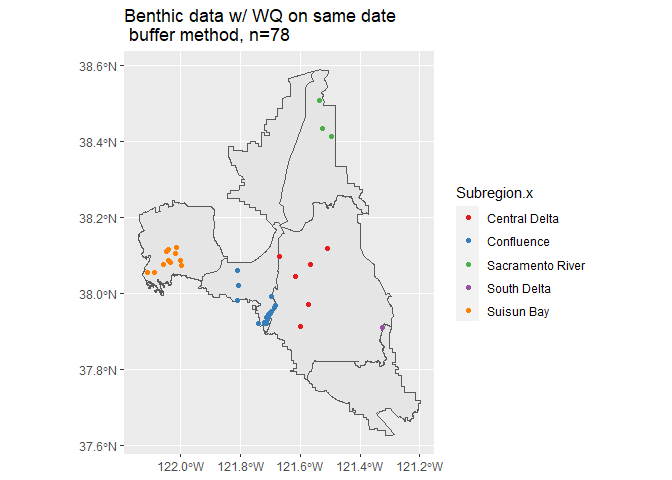

*These processes don't work with the combined CEDENSURF Data because (1) don't have correctly specified analytes called out here, and (2) Filtering on Station does not provide a series of unique dates when we have data from both records (may mean duplicate entries are not properly dealt with)*

The first half of this document follows Eric's CEDEN_Benthic_Data.rmd (with changes), but incorporates the updated source files, and includes the merge code formerly separated into MI_WQ_Join. The main changes to the initial portion are:

***1. It uses CEDENMod_Benthic and CEDENSURF_Mod for wq and sediment rather than Eric's saved data - Eric, is it OK to do this or do you need/prefer the modified excel you have been using if there are differences?**

*Note that the projection wrangling has already been done in these files, and the datum is assumed to be NAD83 where not specified*

***2. has been modified to bring in HUC12 watershed boundaries as a shapefile, and join them to the MI and WQ datasets.**

## CEDEN Data 

This document covers the data analysis for the benthic macroinvertebrate dataset obtained from the CEDEN Advanced Query Tool: 

    https://ceden.waterboards.ca.gov/AdvancedQueryTool

Specs and prior QA/QC procedures used for the Benthic MI data and the WQ/Sediment data are found at:

Benthic MI: https://github.com/WWU-IETC-R-Collab/CEDEN-mod/blob/main/CEDEN_Mod.md

WQ/Sediment: https://github.com/WWU-IETC-R-Collab/CEDENSURF-mod/blob/main/CEDENSURF_Merge.md

## Risk Regions
   
To assign risk regions to the data with spatial coordinates, I used the RiskRegions_DWSC_Update_9292020.shp shapefile obtained from the Tox Box.

## Load in libraries and data


```r
library(tidyverse)
library(sf)
library(here)
library(readxl)
library(nngeo)
library(data.table)
library(zoo)
library(foreach)

## Load risk regions shapefile

USFE.riskregions <- here("data/RiskRegions_DWSC_Update_9292020.shp") %>%
  st_read()%>%
  st_transform(., "NAD83") # Transform into NAD83 to match Benthic
# If didn't want to use NAD83 for everything, could remove last transform and create a WGS84 projection variable. 
# crs.WGS84 <- st_crs(USFE.riskregions)


## Load in CEDEN Benthic data

CEDEN_Benthic <- fread("https://github.com/WWU-IETC-R-Collab/CEDEN-mod/raw/main/Data/Output/CEDENMod_Benthic.csv")


## Load in CEDEN WQ data (122K records)

ceden.wq <- fread("https://github.com/WWU-IETC-R-Collab/CEDEN-mod/raw/main/Data/Output/CEDENMod_WQ.csv") %>%
  st_as_sf(coords=c("Longitude", "Latitude"), 
           crs = "NAD83", remove = F) 
# %>% st_transform(., crs = crs.WGS84) # no longer need to transform to WGS84


## Load in CA Watershed boundaries HUC12
# sourced from https://data.ca.gov/dataset/ca-usgs-watershed-boundary-dataset-12-digit-hydrologic-units

HUC12 <- here("USGS_WBD/") %>%
  st_read() %>% # CRS = WGS 84 pseudomercator
  st_transform(., "NAD83") %>%
  st_intersection(.,USFE.riskregions)
```

## Make CEDEN Benthic shapefile

The CEDENMod data is projected in NAD83 -> do we want to project in WGS84? Keeping all NAD83 for now. 


```r
### Convert to point shapefile

CEDEN_Benthic <- CEDEN_Benthic %>%
  st_as_sf(coords=c("Longitude", "Latitude"),
           crs = "NAD83")

# Transform into WGS84?
# CEDEN_Benthic <- st_transform(CEDEN_Benthic, crs.WGS84)
```

## Plot Ceden Data and Write csv


```r
# Basic plot
ggplot() +
  geom_sf(data = HUC12, color = "green") +
  geom_sf(data = USFE.riskregions, fill = NA) +
  geom_sf(data = CEDEN_Benthic, aes(color = Subregion)) +
  scale_color_brewer(palette = "Set1") + # not color-blind safe
  ggtitle("Ceden Benthic Data")
```

<!-- -->

```r
# Write table

# write.csv(CEDEN_Benthic, "data/ceden_with_RR.csv") # Already printed to csv # This is essentially what is output from CEDENMod
```

# Analysis

## Organize Benthic Data

Grouped the data by station code and sample date so that each record is a sampling event. Within each sampling event, the number of taxa (n_taxa), and counts of select Orders (listed below) and all Phylums are summarized. EPT and ETO indicies and taxa counts were then calculated for each sampling event.

Orders most commonly used in community indicies:

* Ephemeroptera (n_E)
* Plecoptera (n_P)
* Trichoptera (n_T)
* Odonata (n_O)
* Diptera (n_D)


```r
##### Create dataframe set into groups by station and sample date to isolate individual samples.
##### summarise by taxa presence, number of taxa present, and indexes

samp.df <- CEDEN_Benthic %>%
  group_by(StationCode, Date) %>%
  summarise(Subregion = first(Subregion),
            StationName = first(StationName),
            Project = first(Project),
            n_taxa = n(),
            n_E = sum(Orders == "Ephemeroptera", na.rm = TRUE),
            n_P = sum(Orders == "Plecoptera", na.rm = TRUE),
            n_T = sum(Orders == "Trichoptera", na.rm = TRUE),
            n_O = sum(Orders == "Odonata", na.rm = TRUE),
            n_D = sum(Orders == "Diptera", na.rm = TRUE),
            n_Phylum_NA = sum(is.na(Phylum)),
            n_Arthropoda = sum(Phylum == "Arthropoda", na.rm = TRUE),
            n_Annelida = sum(Phylum == "Annelida", na.rm = TRUE),
            n_Nematoda = sum(Phylum == "Nematoda", na.rm = TRUE),
            n_Ectoprocta = sum(Phylum == "Ectoprocta", na.rm = TRUE),
            n_Bacillariophyta = sum(Phylum == "Bacillariophyta", na.rm = TRUE),
            n_Cryptophyta = sum(Phylum == "Cryptophyta", na.rm = TRUE),
            n_Heterokontophyta = sum(Phylum == "Heterokontophyta", na.rm = TRUE),
            n_Ochrophyta = sum(Phylum == "Ochrophyta", na.rm = TRUE),
            n_Coelenterata = sum(Phylum == "Coelenterata", na.rm = TRUE),
            n_Nemertea = sum(Phylum == "Nemertea", na.rm = TRUE),
            n_Mollusca = sum(Phylum == "Mollusca", na.rm = TRUE),
            n_Platyhelminthes = sum(Phylum == "Platyhelminthes", na.rm = TRUE),
            n_Bryozoa = sum(Phylum == "Bryozoa", na.rm = TRUE),
            n_Cyanobacteria = sum(Phylum == "Cyanobacteria", na.rm = TRUE),
            n_Chlorophyta = sum(Phylum == "Chlorophyta", na.rm = TRUE),
            n_Euglenozoa = sum(Phylum == "Euglenozoa", na.rm = TRUE),
            n_Streptophyta = sum(Phylum == "Streptophyta", na.rm = TRUE),
            n_Rhodophyta = sum(Phylum == "Rhodophyta", na.rm = TRUE),
            n_Chordata = sum(Phylum == "Chordata", na.rm = TRUE)
            ) %>%
  mutate(EPT_taxa = sum(n_E, n_P, n_T)) %>%  ### Calculate indexes using mutate
  mutate(EPT_index = EPT_taxa / n_taxa) %>%
  mutate(ETO_taxa = sum(n_E, n_O, n_T)) %>%
  mutate(ETO_index = ETO_taxa / n_taxa)

## Join WBD to MI data
samp.df <- st_join(samp.df, HUC12["HUC12"])
```

## Organize Water Quality Data

Updated to use the modified & combined CEDENSURF WQ/SED data (already with RR joined and filtered)

*Note: "Date" used in this dataset in lieu of SampleDate*

I created a dataframe that grouped by station name and sample date where each record is a water quality sampling event. This way the water quality sampling events can be matched up the the MI sampling events by location and timing.

This dataframe summarized water quality parameters by number of samples during that day, mean, standard deviation, minimum value, and maximum value. Though most of the parameters only had one measurement for the day.

The parameters included were:
* Alkalinity as CaCO3, Total
* Ammonia as N, Total
* Chlorine, Free, Total
* Chlorine, Total Residue, Total
* Oxygen, Dissolved, Total
* pH
* Salinity, Total
* Secchi Depth
* Specific Conductivity, Total
* Temperature
* Turbidity, Total
* Velocity


```r
# While ceden.wq.sf is a sfc_POINT, after this process, wq.stations is a sfc_GEOM, which causes trouble with later analyses. Possible to remove sf prior to this process, or run this before make sf?

wq.stations <- ceden.wq %>%
  group_by(StationName, Date) %>%
  summarise(Project = first(Project),
            n = n(),
            Subregion = first(Subregion),
            Latitude = first(Latitude),
            Longitude = first(Longitude),
            n_Alk = sum(Analyte == "Alkalinity as CaCO3, Total", na.rm = TRUE),
            mean_Alk = mean(Result[Analyte == "Alkalinity as CaCO3, Total"], na.rm = TRUE),
            sd_Alk = sd(Result[Analyte == "Alkalinity as CaCO3, Total"], na.rm = TRUE),
            min_Alk = min(Result[Analyte == "Alkalinity as CaCO3, Total"], na.rm = TRUE),
            max_Alk = max(Result[Analyte == "Alkalinity as CaCO3, Total"], na.rm = TRUE),

            n_N = sum(Analyte == "Ammonia as N, Total", na.rm = TRUE),
            mean_N = mean(Result[Analyte == "Ammonia as N, Total"], na.rm = TRUE),
            sd_N = sd(Result[Analyte == "Ammonia as N, Total"], na.rm = TRUE),
            min_N = min(Result[Analyte == "Ammonia as N, Total"], na.rm = TRUE),
            max_N = max(Result[Analyte == "Ammonia as N, Total"], na.rm = TRUE),
            
            n_Chl_F = sum(Analyte == "Chlorine, Free, Total", na.rm = TRUE),
            mean_Chl_F = mean(Result[Analyte == "Chlorine, Free, Total"], na.rm = TRUE),
            sd_Chl_F = sd(Result[Analyte == "Chlorine, Free, Total"], na.rm = TRUE),
            min_Chl_F = min(Result[Analyte == "Chlorine, Free, Total"], na.rm = TRUE),
            max_Chl_F = max(Result[Analyte == "Chlorine, Free, Total"], na.rm = TRUE),
            
            n_Chl_TR = sum(Analyte == "Chlorine, Total Residual, Total", na.rm = TRUE),
            mean_Chl_TR = mean(Result[Analyte == "Chlorine, Total Residual, Total"], na.rm = TRUE),
            sd_Chl_TR = sd(Result[Analyte == "Chlorine, Total Residual, Total"], na.rm = TRUE),
            min_Chl_TR = min(Result[Analyte == "Chlorine, Total Residual, Total"], na.rm = TRUE),
            max_Chl_TR = max(Result[Analyte == "Chlorine, Total Residual, Total"], na.rm = TRUE),
            
            n_DO = sum(Analyte == "Oxygen, Dissolved, Total", 
                       na.rm = TRUE),
            mean_DO = mean(Result[Analyte == "Oxygen, Dissolved, Total"], 
                           na.rm = TRUE),
            sd_DO = sd(Result[Analyte == "Oxygen, Dissolved, Total"], 
                       na.rm = TRUE),
            min_DO = min(Result[Analyte == "Oxygen, Dissolved, Total"], 
                         na.rm = TRUE),
            max_DO = max(Result[Analyte == "Oxygen, Dissolved, Total"], 
                         na.rm = TRUE),

            n_pH = sum(Analyte == "pH", na.rm = TRUE),
            mean_pH = mean(Result[Analyte == "pH"], na.rm = TRUE),
            sd_pH = sd(Result[Analyte == "pH"], na.rm = TRUE),
            min_pH = min(Result[Analyte == "pH"], na.rm = TRUE),
            max_pH = max(Result[Analyte == "pH"], na.rm = TRUE),
            
            n_Sal = sum(Analyte == "Salinity, Total", na.rm = TRUE),
            mean_Sal = mean(Result[Analyte == "Salinity, Total"], na.rm = TRUE),
            sd_Sal = sd(Result[Analyte == "Salinity, Total"], na.rm = TRUE),
            min_Sal = min(Result[Analyte == "Salinity, Total"], na.rm = TRUE),
            max_Sal = max(Result[Analyte == "Salinity, Total"], na.rm = TRUE),
            
            n_Secc = sum(Analyte == "Secchi Depth", na.rm = TRUE),
            mean_Secc = mean(Result[Analyte == "Secchi Depth"], na.rm = TRUE),
            sd_Secc = sd(Result[Analyte == "Secchi Depth"], na.rm = TRUE),
            min_Secc = min(Result[Analyte == "Secchi Depth"], na.rm = TRUE),
            max_Secc = max(Result[Analyte == "Secchi Depth"], na.rm = TRUE),
            
            n_Cond = sum(Analyte  == "SpecificConductivity, Total", na.rm = TRUE),
            mean_Cond = mean(Result[Analyte == "SpecificConductivity, Total"], na.rm = TRUE),
            sd_Cond = sd(Result[Analyte == "SpecificConductivity, Total"], na.rm = TRUE),
            min_Cond = min(Result[Analyte == "SpecificConductivity, Total"], na.rm = TRUE),
            max_Cond = max(Result[Analyte == "SpecificConductivity, Total"], na.rm = TRUE),
            
            n_Temp = sum(Analyte == "Temperature", na.rm = TRUE),
            mean_Temp = mean(Result[Analyte == "Temperature"], na.rm = TRUE),
            sd_Temp = sd(Result[Analyte == "Temperature"], na.rm = TRUE),
            min_Temp = min(Result[Analyte == "Temperature"], na.rm = TRUE),
            max_Temp = max(Result[Analyte == "Temperature"], na.rm = TRUE),

            n_Turb = sum(Analyte == "Turbidity, Total", na.rm = TRUE),
            mean_Turb = mean(Result[Analyte == "Turbidity, Total"], 
                             na.rm = TRUE),
            sd_Turb = sd(Result[Analyte == "Turbidity, Total"], na.rm = TRUE),
            min_Turb = min(Result[Analyte == "Turbidity, Total"], na.rm = TRUE),
            max_Turb = max(Result[Analyte == "Turbidity, Total"], na.rm = TRUE),
            
            n_Vel = sum(Analyte == "Velocity", na.rm = TRUE),
            mean_Vel = mean(Result[Analyte == "Velocity"], na.rm = TRUE),
            sd_Vel = sd(Result[Analyte == "Velocity"], na.rm = TRUE),
            min_Vel = min(Result[Analyte == "Velocity"], na.rm = TRUE),
            max_Vel = max(Result[Analyte == "Velocity"], na.rm = TRUE),
            ) %>%
  rename(Date.wq = Date) # 3165 records

### Change infinities and NaN values to NA
wq.stations <- wq.stations %>% 
  mutate_if(is.numeric, list(~na_if(., Inf))) %>% 
  mutate_if(is.numeric, list(~na_if(., -Inf))) %>%
  mutate_if(is.numeric, list(~na_if(., "NaN"))) %>%
  mutate_if(is.numeric, list(~na_if(., NaN)))

str(wq.stations$geometry) # sfc_POINT
```


```r
## Join WBD to WQ data
wq.stations <- st_join(wq.stations, HUC12["HUC12"]) 

# CHECK GEOM
str(wq.stations$geometry) # sfc_POINT - good
```

```
## sfc_POINT of length 3165; first list element:  'XY' num [1:2] -121.3 37.7
```

```r
# If sfc_geom, re-convert to sf POINT Object via:
# wq.stations <- st_cast(wq.stations, "POINT")
```

## Dataframe with one record for station {.tabset}

These dataframes are used for mapping.

### Benthic

```r
# One record per Benthic Sample Station

st.df <- CEDEN_Benthic %>%
  group_by(StationCode) %>%
  summarise(n(), n_distinct(Date), first(Subregion)) %>%
  rename(Subregion = `first(Subregion)`)
```


```r
# Sample Stations Plot
ggplot() +
  geom_sf(data = USFE.riskregions) +
  geom_sf(data = st.df, aes(color = Subregion)) +
  scale_color_brewer(palette = "Set1") + # not color-blind safe
  ggtitle("Ceden Benthic Sample Stations")
```

<!-- -->

### Water Quality


```r
# One record per Benthic Sample Station

wq.df <- ceden.wq %>%
  group_by(StationName) %>%
  summarise(n(), n_distinct(Date), first(Subregion)) %>%
  rename(Subregion = `first(Subregion)`)
```


```r
# Sample Stations Plot
ggplot() +
  geom_sf(data = USFE.riskregions) +
  geom_sf(data = wq.df, aes(color = Subregion)) +
  scale_color_brewer(palette = "Set1") + # not color-blind safe
  ggtitle("Ceden WQ Sample Stations")
```

<!-- -->

## Prep MI and WQ data for Join

### Transform Projection to UTM Zone 10n

This transform allows us to compare distances and create buffers. I created a 500 meter buffer around each water quality sampling station.


```r
####### Transform into projection to compare distance

# Transform into UTM Zone 10n EPSG:26910
wq.stations <- st_transform(wq.stations, 26910)
wq.df.u10 <- st_transform(wq.df, 26910)

samp.df.u10 <- st_transform(samp.df, 26910)
st.df.u10 <- st_transform(st.df, 26910)

rr.u10 <- st_transform(USFE.riskregions, 26910)

### Create 500m buffer around WQ sampling locations
wq.stations.buffer <- st_buffer(wq.stations, 1000) # buffer is 1000 meters
```

### Organize

1. Sort dataframes by sample date to facilitate analyses.

2. Add an ID column to each dataframe (which maybe was in the original data, but since this project uses an already edited excel, no ID columns exist)


```r
# Sort data chronologically
samp.df.u10 <- samp.df.u10[order(samp.df.u10$Date), ]
wq.stations <- wq.stations[order(wq.stations$Date.wq), ]

# Add ID labels for each date:location combo
samp.df.u10$ID.benthic <- c(1:length(samp.df.u10$StationCode)) # Gives ID's from 1:160

wq.stations$ID.wq <- c(161: c(160+length(wq.stations$Date.wq))) # Gives ID's 161+
```

## Join using buffers

### Plot WQ buffers and ceden benthic data


```r
ggplot() +
  geom_sf(data = USFE.riskregions) +
  geom_sf(data = wq.stations.buffer, aes(color = Subregion)) +
  scale_color_brewer(palette = "Set1") + # not color-blind safe
  geom_sf(data = st.df.u10, cex=0.7) +
  ggtitle("Ceden WQ Buffers and MI Sampling Locations") + 
  theme(axis.text.x = element_text(angle = 90, vjust = 0.5, hjust=1))
```

<!-- -->

### Join on Buffers & filter to same date & watershed


```r
### Join Benthic locations and WQ buffers, and subset to matching dates
samp.wq.com <- st_join(samp.df.u10, wq.stations.buffer) %>% #4557 records when buffer = 1k
  filter(Date == Date.wq) %>% #109 results (when radius = 1k m), retains multiple matches of WQ per Benthic
  filter(HUC12.x == HUC12.y) # still 109 results!
```

To test what is happening if there are multiple matches, I summarized the results by benthic date:location combinations (There was only one record for each combo prior to the join). 

Yes, multiple matches were retained -> reduced to 78 unique records. The results indicates which benthic samples were duplicated to allow multiple (n) WQ site matches.


```r
check <- samp.wq.com[,1:3] %>%
  group_by(StationCode, Date) %>%
  summarise(n()) # 78 matches
```


```r
### Plot benthic sampling locations that have WQ available on the same date

ggplot() +
  geom_sf(data = USFE.riskregions) +
  geom_sf(data = samp.wq.com, aes(color = Subregion.x)) +
  scale_color_brewer(palette = "Set1") + # not color-blind safe
  ggtitle("Benthic data w/ WQ on same date \n buffer method, n=78 ")
```

<!-- -->


```r
#write.csv(samp.wq.com, "data/ceden_benthic_WQ_WBD.csv", row.names=F)
```

## Nearest Neighbor 
 
I wrote a loop to allow a nearest neighbor analysis to be conducted which required sample data and watershed to match the WQ data being related. 


```r
rm(list=setdiff(ls(), c("samp.df.u10", "wq.stations", "USFE.riskregions", "rr.u10", "st.df.u10", "wq.df.u10")))
```


```r
# The loop takes shp tibbles A (Benthic) and B (WQ). 

A <- samp.df.u10
B <- wq.stations

Dates<- unique(A$Date) %>%
  sort(.,descending = TRUE)

# Loop Prep
JoinResult <- vector("list") # save empty list where output from each day's join will be saved

# Loop
for (i in 1:56){
  A_Sub <- A %>% filter(Date == Dates[i])
  B_Sub <- B %>% filter(Date.wq == Dates[i])
  if (nrow(B_Sub)>0){
  distList <- st_nn(A_Sub, B_Sub, k=1, returnDist= T)
  SubResult <- st_join(A_Sub, B_Sub, join = st_nn, k=1)
  SubResult$Dist <- unlist(distList$dist, recursive = TRUE, use.names = TRUE)
  JoinResult[[i]] <- SubResult}
  }

NN_Results <- do.call(rbind, JoinResult) # Results in 79 matches

nrow(NN_Results) #95
mean(NN_Results$Dist) # Mean distance of matches = 5,126
```

Here you can see in the plot how many "matches" were pulled from outside of MI sample's risk regions


```r
### Plot benthic sampling locations that has WQ available on the same date

ggplot() +
  geom_sf(data = USFE.riskregions) +
  geom_sf(data = NN_Results, aes(color = Subregion.y)) +
  scale_color_brewer(palette = "Set1") +
  ggtitle("Ceden Benthic Data with WQ on same date")
```

<!-- -->

If we filter to make sure only pairs from within the same HUC12 watershed boundaries are retained, we are left with 79 records, (previously 59 records), yet the average distance is only 16 m (reduced from XXXX)


```r
NN_HUC <- NN_Results %>% filter(HUC12.x == HUC12.y) # results in 79 records

mean(NN_HUC$Dist) #16.79 m
```

```
## [1] 15.84626
```

## Join using Nearest Neighbor + Expanded Dates

To increase the availability of WQ data with which to conduct the NN search, I wrote a loop that would replicate WQ data at each site to fill missing dates for up to 3 days past the last sample date.

### 1. Expand WQ data date coverage prior to NN Analysis

This code design takes a shape file "A" and outputs a shapefile "Pad.result" which has filled NA's following a sample with that sample's data for up to 3 days past.

It would be great to be able to also do the other direction, but I have not yet figured that.


```r
str(wq.stations$geometry) # Needs to be sfc_POINT not _GEOM
```

```
## sfc_POINT of length 3165; first list element:  'XY' num [1:2] 630604 4257828
```

```r
### This code outputs a shapefile "Pad.result" which has filled NA's with prior data for up to 3 days.

A <- wq.stations

A <- A %>% dplyr::mutate(lat = sf::st_coordinates(.)[,1],
                lon = sf::st_coordinates(.)[,2])

### 1. Prepare Data: Add a column with id that will have no date duplication, and remove shpfile properties (zoo can't properly convert a SF)

# Remove shp properties
A <- A %>% st_set_geometry(NULL)

### 2. LOOP 1 Separates dataframe by unique name-analyte combinations to remove duplication of dates; converts to zoo and creates a daily timestep to prep for next steps. Creates a list of these dataframes.

# Items required for loop

ID <- unique(A$StationName) # Vector to loop over

A.list <- list() # Empty List to store output

# loop 1

for (i in 1:length(ID)){
  A_sub <- A %>% filter(StationName == ID[i]) # subset records for unique id (station name)
  zA <- zoo(A_sub, as.Date(A_sub$Date.wq)) # convert to zoo
  g <- seq(start(zA), c(end(zA)+4), "day") %>% 
  zoo(., as.Date(.)) # make TS that adds 3 days to end of original df
  A.list[[i]]<- merge(zA, g)} ### Merge
```


```r
### 2: Define function to fill NA's with true data for up to 3 days past, then loop it through the dataset

# Define function: replaces NA's with previous value (up to 3 locations ahead)

f2 <- function(x) replace(x, 1:4, x[1])  

# Foreach loop, runs paralell processes #~ 5 minutes 

Pad.result <- foreach(i = 1:length(A.list), .combine=rbind) %dopar% {
  m <- A.list[[i]] # take one subset with unique dates
  for (col in 1:ncol(m)) { # nested loop that pads up to 3 dates out
        x <- m[,col]
        m[,col]<- ave(x, cumsum(!is.na(x)), FUN = f2)
        }
  m <- fortify.zoo(m) %>%   # convert subset back to dataframe
        select(-g) %>%    # Removes arbitrary date column
        filter(!is.na(StationName))# filter na's
}

# Fix dates
Pad.result <- Pad.result %>% filter(!is.na(Latitude))%>%
  rename(OriginalWQ.Date = Date.wq) %>% # Create new column name to hold date of original data used to create each record.
  rename(Date.wq = Index) # extract dates for query

# write.csv(Pad.result, "data/Expanded_Dates_WQ.csv", row.names=F)
```


```r
### 3. Convert back to SF

# Previous doc assumed that CEDENMOD had coords in WSG84 then converted to NAD83. THis uses the lat and lon extracted from that file to reapply NAD 83. The file CEDENMOD_WQ created by Skyler should have been read in as NAD83

## EPSG:26910 = NAD83 / UTM zone 10N
## ESRI:102643 = NAD 1983 StatePlane California III FIPS 0403 Feet

Pad.result <- Pad.result %>% 
  st_as_sf(coords = c("lat", "lon"), crs = "EPSG:26910", remove = F)
```

The dataset went from 0 records to 12352 using this padding. 

*Note: Skyler recommends converting all to NAD83/CAFIPS before NN analysis*


```r
# Transform to NAD83 StatePlane CA FIPS
# Pad.result <- st_transform(Pad.result, "ESRI:102643")

# st_crs(Pad.result) # NAD83 SP CA FIPS 0403
```

### 2. Nearest Neighbor Analysis

This nested loop subsets each dataset for unique dates, then runs nearest neighbor analysis within data of each date, and appends the distance between datapoints onto the matrix. The "If" loop allows the "For" loop to bypass MI sample dates for which there are no WQ samples on the same date.


```r
# The loop takes shp tibbles A (Benthic) and B (WQ). # If this fails due to memory allocation, try selecting a minimum of columns to reduce working memory.

A <- samp.df.u10
  # select(samp.df.u10, c(ID.benthic, StationCode, StationName, Date, geometry))

B <- Pad.result
  #select(wq.stations, c(ID.wq, StationName,Date.wq))

Dates<- unique(A$Date) %>%
  sort(.,descending = TRUE)
```


```r
# IF YOU GET THIS: “Error: cannot allocate vector of size 11.2 Gb”
# TRY increasing the memory limit - solution from:
# https://statisticsglobe.com/r-error-cannot-allocate-vector-of-size-n-gb
# memory.limit() # currently at 16290
# memory.limit(35000) # Run this if run into memory limits
```


```r
# Loop Prep
JoinResult <- vector("list") # save empty list where output from each day's join will be saved

# Loop
for (i in 1:56){
  A_Sub <- A %>% filter(Date == Dates[i])
  B_Sub <- B %>% filter(Date.wq == Dates[i])
  if (nrow(B_Sub)>0){
  distList <- st_nn(A_Sub, B_Sub, k=1,  returnDist= T)
  SubResult <- st_join(A_Sub, B_Sub, join = st_nn, k=1)
  SubResult$Dist <- unlist(distList$dist, recursive = TRUE, use.names = TRUE)
  JoinResult[[i]] <- SubResult}
  }

NN_Results <- do.call(rbind, JoinResult) # Results in 121 matches with average distance of 14,4420 m. Yikes! Why would having MORE options make the average distance btwn NN matches increase? Shouldn't it decrease? UNLESS it's because those additional matches were mostly long shots.
```
If we filter to make sure only pairs from within the same HUC12 watershed boundaries are retained, we are *still* left with 79 records (previously 59 records), and the average distance is 16.8 m (the same as before) 


```r
NN_HUC <- NN_Results %>% filter(HUC12.x == HUC12.y) # results in 79 records

mean(NN_HUC$Dist)
```

```
## [1] 15.8859
```


```r
### Plot benthic sampling locations that has WQ available on the same date

ggplot() +
  geom_sf(data = USFE.riskregions) +
  geom_sf(data = NN_HUC, aes(color = Subregion.y)) +
  scale_color_brewer(palette = "Set1") +
  ggtitle("Ceden Benthic w/ WQ Matched in WBD")
```

<!-- -->


## NN Neighbor Expand WQ Dates (7 days)?

### Expanding Data

```r
str(wq.stations$geometry) # Needs to be sfc_POINT not _GEOM
```

```
## sfc_POINT of length 3165; first list element:  'XY' num [1:2] 630604 4257828
```

```r
### This code outputs a shapefile "Pad.result" which has filled NA's with prior data for up to 3 days.

A <- wq.stations

A <- A %>% dplyr::mutate(lat = sf::st_coordinates(.)[,1],
                lon = sf::st_coordinates(.)[,2])

### 1. Prepare Data: Add a column with id that will have no date duplication, and remove shpfile properties (zoo can't properly convert a SF)

# Remove shp properties
A <- A %>% st_set_geometry(NULL)

### 2. LOOP 1 Separates dataframe by unique name-analyte combinations to remove duplication of dates; converts to zoo and creates a daily timestep to prep for next steps. Creates a list of these dataframes.

# Items required for loop

ID <- unique(A$StationName) # Vector to loop over

A.list <- list() # Empty List to store output

# loop 1

for (i in 1:length(ID)){
  A_sub <- A %>% filter(StationName == ID[i]) # subset records for unique id (station name)
  zA <- zoo(A_sub, as.Date(A_sub$Date.wq)) # convert to zoo
  g <- seq(start(zA), c(end(zA)+4), "day") %>% 
  zoo(., as.Date(.)) # make TS that adds 3 days to end of original df
  A.list[[i]]<- merge(zA, g)} ### Merge
```


```r
### 2: Define function to fill NA's with true data for up to 3 days past, then loop it through the dataset

# Define function: replaces NA's with previous value (up to 3 locations ahead)

f2 <- function(x) replace(x, 1:7, x[1])  

# Foreach loop, runs paralell processes #~ 5 minutes 

Pad.result <- foreach(i = 1:length(A.list), .combine=rbind) %dopar% {
  m <- A.list[[i]] # take one subset with unique dates
  for (col in 1:ncol(m)) { # nested loop that pads up to 3 dates out
        x <- m[,col]
        m[,col]<- ave(x, cumsum(!is.na(x)), FUN = f2)
        }
  m <- fortify.zoo(m) %>%   # convert subset back to dataframe
        select(-g) %>%    # Removes arbitrary date column
        filter(!is.na(StationName))# filter na's
}

# Fix dates
Pad.result <- Pad.result %>% filter(!is.na(Latitude))%>%
  rename(OriginalWQ.Date = Date.wq) %>% # Create new column name to hold date of original data used to create each record.
  rename(Date.wq = Index) # extract dates for query

# write.csv(Pad.result, "data/Expanded_Dates_WQ.csv", row.names=F)
```


```r
### 3. Convert back to SF

# Previous doc assumed that CEDENMOD had coords in WSG84 then converted to NAD83. THis uses the lat and lon extracted from that file to reapply NAD 83. The file CEDENMOD_WQ created by Skyler should have been read in as NAD83

## EPSG:26910 = NAD83 / UTM zone 10N
## ESRI:102643 = NAD 1983 StatePlane California III FIPS 0403 Feet

Pad.result <- Pad.result %>% 
  st_as_sf(coords = c("lat", "lon"), crs = "EPSG:26910", remove = F)
```

### NN Analysis

```r
# The loop takes shp tibbles A (Benthic) and B (WQ). # If this fails due to memory allocation, try selecting a minimum of columns to reduce working memory.

A <- samp.df.u10
  # select(samp.df.u10, c(ID.benthic, StationCode, StationName, Date, geometry))

B <- Pad.result
  #select(wq.stations, c(ID.wq, StationName,Date.wq))

# Create new column to filter on: Dates by HUC12 WBD

A$Dates_in_WBD <- paste(A$Date, "-", A$HUC12)
B$Dates_in_WBD <- paste(B$Date.wq, "-", B$HUC12)

# Create Vector of unique separator
DateWBD <- unique(A$Dates_in_WBD) %>%
  sort()
```


```r
# Loop Prep
JoinResult <- vector("list") # save empty list where output from each day's join will be saved

# Loop
for (i in 1:length(DateWBD)){
  A_Sub <- A %>% filter(Dates_in_WBD == DateWBD[i])
  B_Sub <- B %>% filter(Dates_in_WBD == DateWBD[i])
  if (nrow(B_Sub)>0){
  distList <- st_nn(A_Sub, B_Sub, k=1, returnDist= T)
  SubResult <- st_join(A_Sub, B_Sub, join = st_nn, k=1)
  SubResult$Dist <- unlist(distList$dist, recursive = TRUE, use.names = TRUE)
  JoinResult[[i]] <- SubResult}
  }

NN_Results <- do.call(rbind, JoinResult) # Results in 84 matches

mean(NN_Results$Dist) # Average distance was 663
```

## Results

Methods vs Number & Distance of Matches

* Using Eric's WQ data, there were **79** total Benthic samples with WQ samples on the same date. 

* After changing to use the most recent CEDENMod_WQ dataset, we had **95** matches. 

* By using the "expanded" WQ data (with data expanded to fill up to 3 days later), that number increases to **121** matches.

* **With both the regular and "expanded" df, filtering on HUC12 boundaries reduced the number of matches to 79**

* **With both the regular and "expanded" wq df, filtering on HUC12 boundaries reduced the mean distance to ~17m**

* By expanding WQ data up to 7 days and filtering on HUC12 boundaries, there are **84 matches for date and HUC12, with a mean dist of 660 m**


