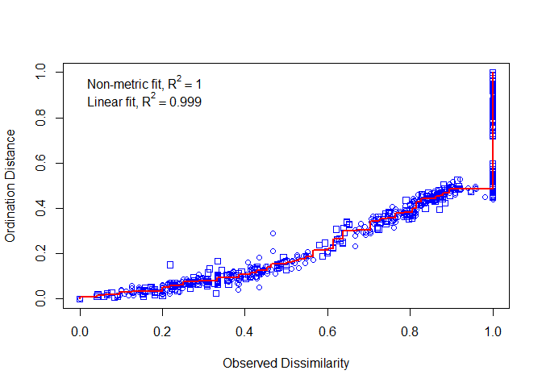
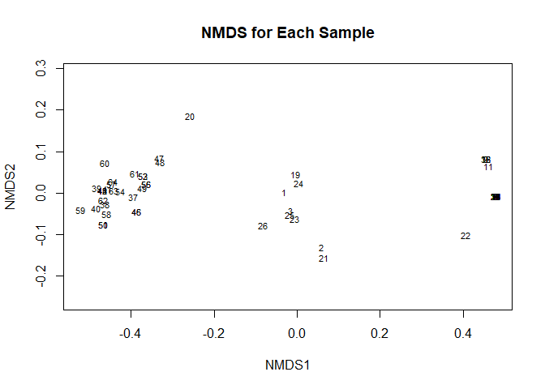
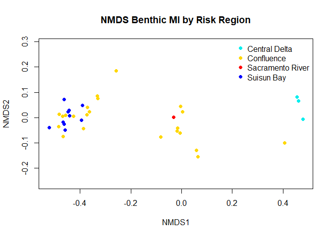
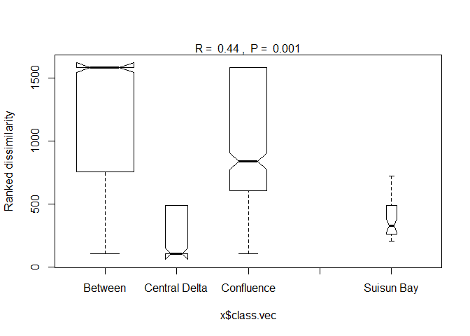
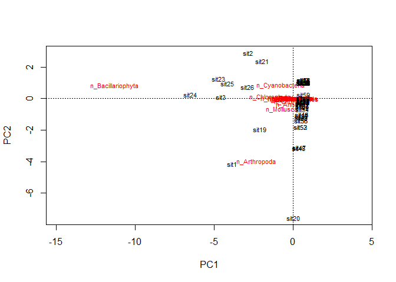
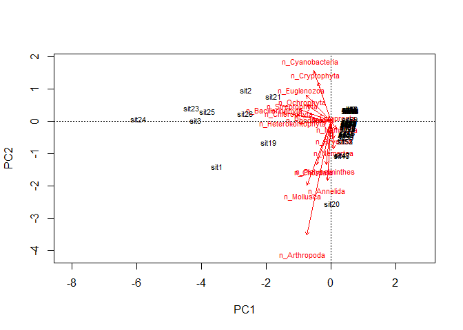
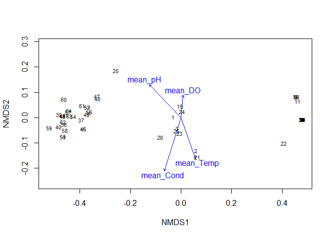
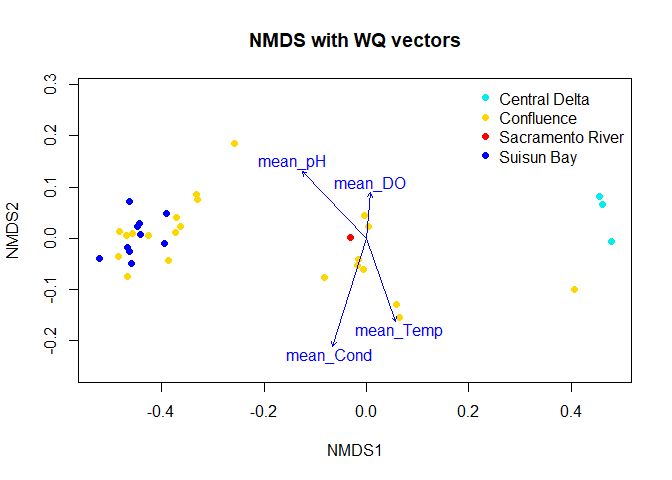

## Load in libraries and data


```r
library(tidyverse)
library(sf)
library(here)
library(readxl)
library(vegan)

#Load in combined benthic sampling and water quality data
com.dates <- read.csv("data/ceden_benthic_WQ.csv")
```

## Prepare data


```r
#Create dataframe with selected variables

ceden.sel <- com.dates %>%
  select(StationCode, SampleDate, Subregion.x, n_taxa, n_E,
         n_P, n_T, n_O, n_D, n_Arthropoda, n_Annelida, 
         n_Nematoda, n_Ectoprocta, n_Bacillariophyta,
         n_Cryptophyta, n_Heterokontophyta, n_Ochrophyta,
         n_Coelenterata, n_Nemertea, n_Mollusca, n_Platyhelminthes,
         n_Bryozoa, n_Cyanobacteria, n_Chlorophyta, n_Euglenozoa,
         n_Streptophyta, n_Rhodophyta, n_Chordata, EPT_taxa, EPT_index,
         ETO_taxa, ETO_index,
         
         mean_Alk, mean_DO, mean_pH, mean_Sal, mean_Secc, mean_Cond,
         mean_Temp, mean_Turb, mean_Vel
         
         )

#Set subregion as a factor
ceden.sel$Subregion.x <- as.factor(ceden.sel$Subregion.x)

### Create dataframe with just taxa counts for by Phylums
taxa <- ceden.sel %>%
  select(StationCode, SampleDate, Subregion.x, n_Arthropoda, n_Annelida, 
         n_Nematoda, n_Ectoprocta, n_Bacillariophyta,
         n_Cryptophyta, n_Heterokontophyta, n_Ochrophyta,
         n_Coelenterata, n_Nemertea, n_Mollusca, n_Platyhelminthes,
         n_Bryozoa, n_Cyanobacteria, n_Chlorophyta, n_Euglenozoa,
         n_Streptophyta, n_Rhodophyta, n_Chordata)

## WQ Data, create new dataframe with only the variables that have enough data to be included
env <- ceden.sel %>%
  select(StationCode, SampleDate, Subregion.x, mean_DO, mean_pH, mean_Cond, mean_Temp,)
```

## NMDS


```r
v.dist <- vegdist(taxa[4:22])

nmds <- metaMDS(v.dist)
```

```
## Run 0 stress 0.02011092 
## Run 1 stress 0.01919416 
## ... New best solution
## ... Procrustes: rmse 0.007396484  max resid 0.04350709 
## Run 2 stress 0.01907467 
## ... New best solution
## ... Procrustes: rmse 0.01191752  max resid 0.04656466 
## Run 3 stress 0.0198172 
## Run 4 stress 0.01814664 
## ... New best solution
## ... Procrustes: rmse 0.02559979  max resid 0.1232186 
## Run 5 stress 0.01913028 
## Run 6 stress 0.01992589 
## Run 7 stress 0.01948333 
## Run 8 stress 0.01946078 
## Run 9 stress 0.01966754 
## Run 10 stress 0.01968518 
## Run 11 stress 0.01814637 
## ... New best solution
## ... Procrustes: rmse 7.445609e-05  max resid 0.0001787818 
## ... Similar to previous best
## Run 12 stress 0.02050773 
## Run 13 stress 0.02024701 
## Run 14 stress 0.02021346 
## Run 15 stress 0.01963952 
## Run 16 stress 0.01814709 
## ... Procrustes: rmse 0.0002123356  max resid 0.001370006 
## ... Similar to previous best
## Run 17 stress 0.02231639 
## Run 18 stress 0.01907426 
## Run 19 stress 0.01931291 
## Run 20 stress 0.01896244 
## *** Solution reached
```

```r
nmds
```

```
## 
## Call:
## metaMDS(comm = v.dist) 
## 
## global Multidimensional Scaling using monoMDS
## 
## Data:     v.dist 
## Distance: bray 
## 
## Dimensions: 2 
## Stress:     0.01814637 
## Stress type 1, weak ties
## Two convergent solutions found after 20 tries
## Scaling: centring, PC rotation 
## Species: scores missing
```

```r
stressplot(nmds, v.dist)
```

<!-- -->

```r
plot(nmds, type = "t", main = "NMDS for Each Sample")
```

<!-- -->

```r
colvec <- c("cyan2", "gold", "red", "blue")
plot(nmds, type = "n", main = "NMDS Benthic MI by Risk Region")
with(taxa, points(nmds, display = "sites", col = colvec[Subregion.x],
                  pch = 21, bg = colvec[Subregion.x]))
with(taxa, legend("topright", legend = levels(Subregion.x), bty = "n", col = colvec, pch = 21, pt.bg = colvec))
```

<!-- -->


```r
est <- as.factor(taxa$Subregion.x)
results <- (anosim(v.dist, grouping = est))
summary(results)
```

```
## 
## Call:
## anosim(x = v.dist, grouping = est) 
## Dissimilarity: bray 
## 
## ANOSIM statistic R: 0.4397 
##       Significance: 0.001 
## 
## Permutation: free
## Number of permutations: 999
## 
## Upper quantiles of permutations (null model):
##    90%    95%  97.5%    99% 
## 0.0308 0.0478 0.0629 0.0868 
## 
## Dissimilarity ranks between and within classes:
##                     0%   25%     50%    75%   100%    N
## Between          102.0 756.5 1585.50 1585.5 1585.5 1253
## Central Delta    102.0 102.0  102.00  490.0  490.0  190
## Confluence       102.0 603.5  839.25 1585.5 1585.5  528
## Sacramento River    NA    NA      NA     NA     NA    0
## Suisun Bay       205.5 262.5  327.00  490.0  722.0   45
```

```r
plot(results, ylab = "Ranked dissimilarity")
```

<!-- -->

## WQ Vectors


```r
vare.pca <- rda(taxa[4:22])
vare.pca
```

```
## Call: rda(X = taxa[4:22])
## 
##               Inertia Rank
## Total           416.7     
## Unconstrained   416.7   18
## Inertia is variance 
## 
## Eigenvalues for unconstrained axes:
##   PC1   PC2   PC3   PC4   PC5   PC6   PC7   PC8 
## 350.7  46.5  11.7   3.6   2.4   0.8   0.4   0.2 
## (Showing 8 of 18 unconstrained eigenvalues)
```

```r
plot(vare.pca)
```

<!-- -->

```r
biplot(vare.pca, scaling = -1)
```

<!-- -->


```r
env <- as.data.frame(env)

ef <- envfit(nmds, env[4:7], na.rm = TRUE, permutations = 999)
ef
```

```
## 
## ***VECTORS
## 
##              NMDS1    NMDS2     r2 Pr(>r)    
## mean_DO    0.08056  0.99675 0.0626  0.197    
## mean_pH   -0.69366  0.72030 0.2579  0.001 ***
## mean_Cond -0.29986 -0.95398 0.3840  0.001 ***
## mean_Temp  0.33299 -0.94293 0.2320  0.002 ** 
## ---
## Signif. codes:  0 '***' 0.001 '**' 0.01 '*' 0.05 '.' 0.1 ' ' 1
## Permutation: free
## Number of permutations: 999
## 
## 14 observations deleted due to missingness
```

```r
scores(ef, "vectors")
```

```
##                 NMDS1      NMDS2
## mean_DO    0.02016281  0.2494689
## mean_pH   -0.35226668  0.3657933
## mean_Cond -0.18582483 -0.5911867
## mean_Temp  0.16039398 -0.4541852
```

```r
plot(nmds, type = "t", scale = -1)
plot(ef, scale = -1)
```

<!-- -->

```r
plot(nmds, type = "n", main = "NMDS with WQ vectors", scale = -1)
with(taxa, points(nmds, display = "sites", col = colvec[Subregion.x],
                  pch = 21, bg = colvec[Subregion.x]))
with(taxa, legend("topright", legend = levels(Subregion.x), bty = "n", col = colvec, pch = 21, pt.bg = colvec))
plot(ef, scale = -1)
```

<!-- -->
